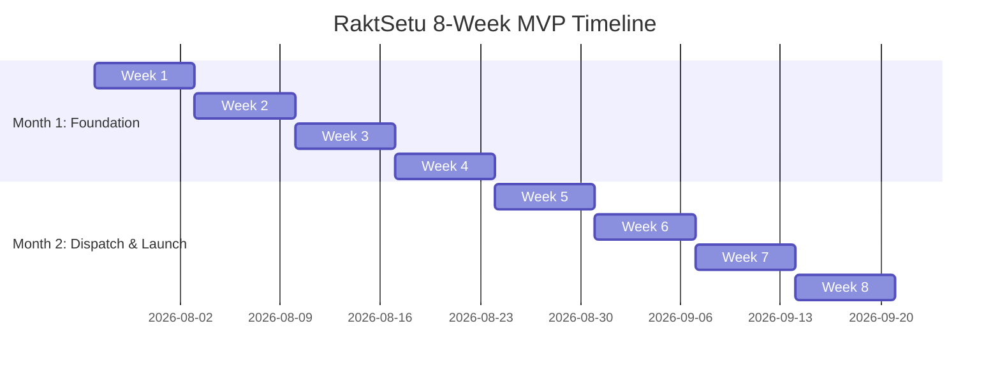

# RaktSetu — Real-Time Blood Donation & Blood Bank Ecosystem

RaktSetu (*Bridge of Blood*) is a real-time blood donation platform designed to modernize the blood donation ecosystem by connecting donors, recipients, hospitals, blood banks, and volunteers through a reliable, AI-assisted digital service.

---

## 🚀 AI Engineering Operating System

This repository is optimized for collaboration between human engineers and AI coding agents.

### Core Specifications
* **Master Instructions**: [AGENT.md](file:///c:/Users/akhil/RaktSetu/AGENT.md)
* **Agent Context Entry**: [CLAUDE.md](file:///c:/Users/akhil/RaktSetu/CLAUDE.md)
* **Product Requirements Document**: [PRD.md](file:///c:/Users/akhil/RaktSetu/docs/PRD.md)
* **Execution Daily Build Plan**: [BUILD_PLAN.md](file:///c:/Users/akhil/RaktSetu/docs/BUILD_PLAN.md)
* **8-Week Detailed Plan (PDF)**: [8-Week-Daily-Plan-RaktSetu.pdf](file:///c:/Users/akhil/RaktSetu/docs/8-Week-Daily-Plan-RaktSetu.pdf)

---

## 📅 8-Week Daily Build Plan Summary

Designed as a pilot-ready MVP targeting a single city launch with an installable Next.js 15 PWA frontend and a Node.js + Express backend.



### Key Milestones
* **Month 1 (Weeks 1–4): Foundation, Donors & Requests**
  * OTP auth, geo-located verified donors with live availability + eligibility engine.
  * PostGIS compatibility-expanded search, one-tap emergency request state machine, and data-hygiene crons.
  * *Milestone Tag:* `v0.2.0-month1-complete`
* **Month 2 (Weeks 5–8): Dispatch, Lifecycle & Launch**
  * Wave dispatch with push notifications + SMS fallback.
  * Full match lifecycle with chat + reliability scoring, QR-verifiable certificates.
  * Hospital mini-portal with inventory-first hints, admin console, DPDP compliance, and production deployment.
  * *Milestone Tag:* `v1.0.0-pilot`

---

## 🛠️ Tech Stack & Ownership Split

To ensure high-quality review, the entire codebase utilizes **TypeScript** across both backend and frontend layers.

| Layer | Technology | Primary Owner | Description / Key Focus |
|---|---|---|---|
| **Backend API** | Node.js 20 + Express + TypeScript + zod | **Akhilan** | Data store, backend logic, PostGIS geosearch, worker queues |
| **ORM / Database** | PostgreSQL 16 + PostGIS + Prisma | **Akhilan** | Radius-based searches (`ST_DWithin` with GiST indexing) |
| **Cache / Queue** | Redis 7 + BullMQ | **Akhilan** | Wave dispatch queue with delayed job escalations |
| **Push / SMS** | FCM Push + MSG91 SMS Fallback | **Akhilan** | Reliable multi-channel emergency notification pipeline |
| **Frontend Framework** | Next.js 15 (App Router) + React 18 | **Karthikeyan** | PWA-first installable client, mobile-first responsive design |
| **UI Library** | Tailwind CSS + shadcn/ui | **Karthikeyan** | Theme system (blood red palette), accessible Radix components |
| **Frontend Auth** | Auth.js v5 Credentials | **Karthikeyan** | Client-side integration with backend verification endpoints |
| **Deploy & CI/CD** | Docker Compose + Caddy + GH Actions | **Karthikeyan** | Multi-stage production containerization, SSL, branch protections |

---

## 📂 Project Structure (Target)

```text
RaktSetu/
├── AGENT.md           # Master instruction rules for AI agents
├── CLAUDE.md          # Agent configuration entrypoint
├── README.md          # Project overview & roadmap
├── CHANGELOG.md       # Project changelog log
├── LICENSE            # Project license
├── docs/              # Product specifications and architecture plans
├── workflows/         # Repeatable task execution guides
├── specs/             # Modular feature specifications
├── tasks/             # Actionable task backlog
├── templates/         # Reusable markdown templates
├── examples/          # Implementation pattern references
├── knowledge/         # Domain-specific knowledge base
├── backend/           # Node.js 20 Express Backend API
├── frontend/          # Next.js 15 PWA frontend application
├── shared/            # Shared zod schemas & configurations
└── infra/             # Deployment Docker & Caddy configurations
```

---

## ⚠️ Collaboration Rules
1. **Never start a week** until the previous week's git tag is successfully pushed.
2. **Karthikeyan reviews all backend PRs** written by Akhilan to ensure quality and mentorship.
3. **Cut scope before cutting quality** — the core emergency loop must be flawless.
4. **Test on physical devices** starting from Week 5 to verify real PWA push notifications and offline flows.
