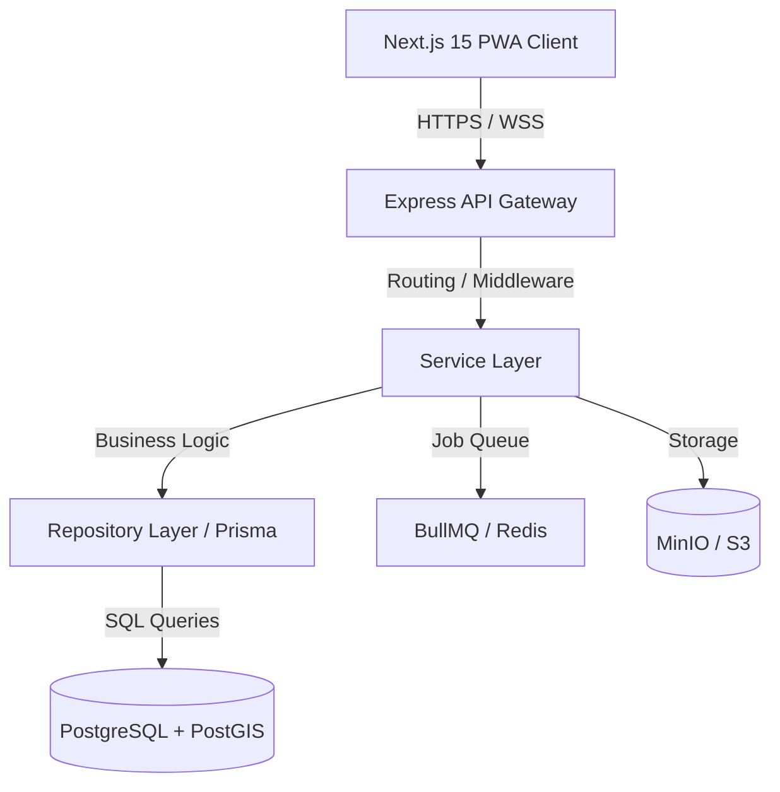

# System Architecture

This document describes the architectural layout of the RaktSetu platform.

## Overview

RaktSetu is split into a client-server architecture built on single-language TypeScript to optimize development speed and code sharing.

## Layers

### 1. Frontend (Next.js 15 PWA)
- Serves as the user interface for donors, recipients, and hospital administrators.
- Uses Tailwind CSS and shadcn/ui.
- Handles responsive interfaces down to 375px mobile viewports.
- Service Workers enable installability and offline support for directories and emergency contacts.

### 2. API Layer (Express + TypeScript)
- Acts as the gateway for request validation, routing, error handling, and authorization.
- Validates schemas using `zod` shared schemas.

### 3. Service Layer
- Contains core domain logic (e.g., matching formulas, eligibility algorithms, and notification dispatch loops).
- Runs separately from database queries for testability.

### 4. Repository Layer (Prisma ORM)
- Abstracts database mutations and queries.
- Incorporates custom SQL query escapes for PostGIS operations.

### 5. Data Stores
- **PostgreSQL**: Relational storage for users, matches, and requests.
- **PostGIS**: Spatial database extension for geographic calculations.
- **Redis**: Fast cache storage for OTP validations and job control tables.
