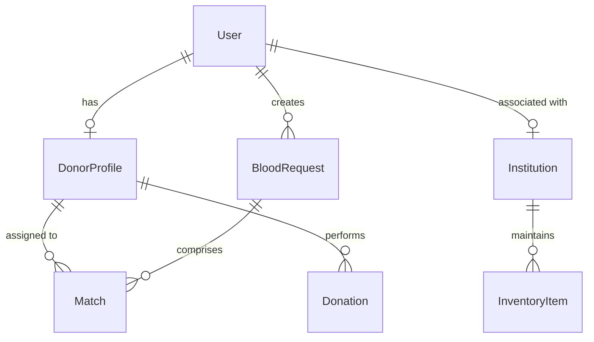

# Database Documentation

RaktSetu utilizes PostgreSQL 16 enhanced with the PostGIS extension for geo-spatial queries.

## ER Diagram

## Schema Entities

### User
Stores central user credentials, phone authentication status, role mappings, and platform authorizations.

### DonorProfile
Aggregates blood groups, availability states, eligibility tracking dates, reliability scores, and fuzzed geo-locations.
- **Geo Field**: Coordinates are saved using PostGIS `geometry(Point, 4326)`.
- **Index**: A GiST index must be applied on the geometry column for rapid location searches.

### Institution
Represents hospitals, blood banks, or NGO hubs with verification stamps and physical coordinates.

### InventoryItem
Tracks the amount of blood units per component and type (Whole blood, PRBC, FFP, platelets).

### BloodRequest
Logs active emergency demands, patient references, urgency indices, and matching lifecycle progression state.

### Match
Traces individual match states (notified, responded, accepted, en route, arrived, completed/no-show) and links specific donors to requests.

### Donation
Logs actual completed donation audits and references certificates.
