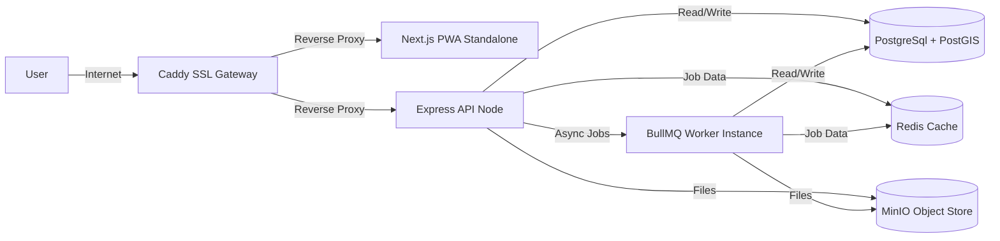

# Deployment Blueprint

RaktSetu targets hosting architectures built on virtual private servers (VPS) and containers.

## Production Blueprint

## Infrastructure Settings

### 1. Containers (Docker Compose)
- Split into services: `frontend` (Next.js), `backend` (Express app), `worker` (BullMQ workers), `postgis`, `redis`, and `minio`.

### 2. Reverse Proxy (Caddy)
- Automates Let's Encrypt SSL/TLS setups.
- Handles HSTS and Content Security Policies.

### 3. Backups
- Automatic nightly database dumps mapped and pushed directly to object storage.
- 30-day retention policies enforced.
