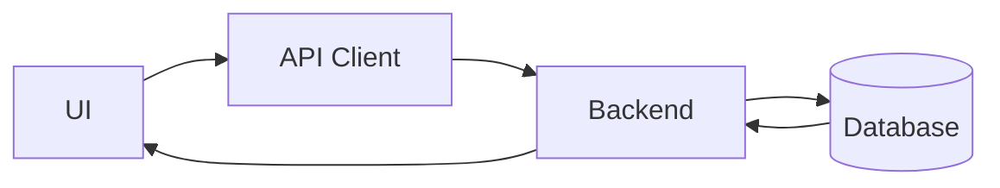

# Frontend Structure

## Overview

This document outlines the codebase organization, design patterns, and standards of the `raktsetu-ui` frontend application.

---

# Tech Stack

- **Next.js 15**: Core framework using React 19.
- **React 19**: Rendering and hook logic.
- **TypeScript**: Static typing for reliability.
- **Tailwind CSS**: Core utility-first styles.
- **React Query**: Server-state management and API caching.
- **Zustand**: Client-state management.

---

# Folder Structure

- `app/` - Next.js routing and page layouts (App Router).
- `components/` - Global and shared UI components (including shadcn/ui).
- `hooks/` - Shared custom React hooks.
- `lib/` - Client instantiations and third-party setups.
- `services/` - API client fetching logic.
- `store/` - Zustand client state management.
- `types/` - Shared type declarations.
- `utils/` - Utility helper functions.

---

# Components

## MatchStepper

- **Purpose**: Render real-time match progression.
- **Props**: `matchId`, `currentStatus`, `timestamps`.
- **Example**:
  ```tsx
  <MatchStepper
    matchId="xyz"
    currentStatus="ACCEPTED"
    timestamps={{ acceptedAt: new Date() }}
  />
  ```

---

# State Management

- **Global**: Zustand stores handle non-persistent app states.
- **Server**: React Query manages fetched backend APIs, cache validation, and mutations.
- **Local**: React state hooks (`useState`, `useReducer`) for isolated UI behaviors.

---

# Data Flow



---

# API Layer

- **Authentication**: JWT validation via HttpOnly cookies.
- **Validation**: Strict schema checks on data contracts via Zod.
- **Caching**: Automated stale-while-revalidate caches using React Query.
- **Error handling**: Uniform HTTP status interceptors with Toast notifications.

---

# Coding Standards

- **Naming**: PascalCase for components, camelCase for functions/variables.
- **Folder conventions**: Group pages inside route groups (`(auth)`, `(app)`) as per Next.js 15 structure.
- **Component conventions**: Functional components only, utilizing absolute paths (`@/*`).
- **Hook conventions**: Separate data fetching hooks from component logic.
