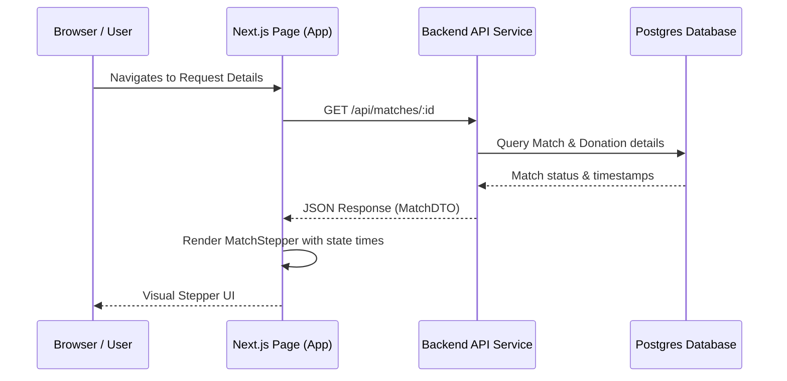

# Project Structure & Data Flow

This document outlines the directory structure, key components, and data flow of the `raktsetu-ui` frontend application. It also includes a schema review checklist for database-to-UI alignment.

---

## Directory Structure

```
frontend/raktsetu-ui/
├── app/                  # Next.js App Router (pages, layouts, routing)
│   ├── (auth)/           # Authentication routes (login, register)
│   ├── (app)/            # Primary application pages (dashboard, search)
│   │   ├── request/      # Blood request pages & request flows
│   │   └── page.tsx      # Main user dashboard
│   ├── layout.tsx        # Root layout
│   └── page.tsx          # Homepage
├── components/           # Reusable UI component library (shadcn/ui, custom)
│   ├── ui/               # Core design primitives (button, dialog, input)
│   └── shared/           # Business-specific components (stepper, card)
├── lib/                  # Utilities, API clients, and configuration
│   └── utils.ts          # Tailwind CSS merge utilities
├── public/               # Static assets (images, icons)
└── tsconfig.json         # TypeScript configuration
```

---

## Key Components

### 1. Stepper Component (`MatchStepper`)

- **Location**: `components/shared/match-stepper.tsx`
- **Purpose**: Displays the real-time status of a blood match request (e.g., Notified ➔ Responded ➔ Accepted ➔ Arrived ➔ Donated).
- **Props**: Takes a `matchId` or the `Match` data object containing the state timestamps.

### 2. Request Card (`BloodRequestCard`)

- **Location**: `components/shared/blood-request-card.tsx`
- **Purpose**: Renders detailed summary cards of active requests, including blood type needed, urgency badges, units fulfilled, and a link to the stepper.

---

## Data Flow



---

## Schema Review Checklist (For Akhilan)

To ensure the backend database schema fully supports the Match Tracking Stepper component in the UI, review the following fields in the `Match` and `Donation` schemas:

### Stepper State & Timestamp Alignment:

- **State 1: NOTIFIED**
  - **Prisma Field**: `Match.notifiedAt` (DateTime) or `Match.createdAt` (DateTime).
  - **Verification**: Verified. `Match.notifiedAt` is present and defaults to `now()`.

- **State 2: RESPONDED**
  - **Prisma Field**: `Match.respondedAt` (DateTime?).
  - **Verification**: Verified. `Match.respondedAt` is present and nullable.

- **State 3: ACCEPTED**
  - **Prisma Field**: `Match.acceptedAt` (DateTime?).
  - **Verification**: Verified. `Match.acceptedAt` is present and nullable.

- **State 4: ARRIVED**
  - **Prisma Field**: _Missing in Match Table_.
  - **Verification**: **ACTION REQUIRED.** The `MatchStatus` enum contains `ARRIVED`, but there is no corresponding `arrivedAt` timestamp field in the `Match` model.
  - **Question for Akhilan**: Should we add `arrivedAt DateTime?` to the `Match` model to track exactly when a donor arrives at the donation center?

- **State 5: DONATED**
  - **Prisma Field**: `Donation.donatedAt` (DateTime) via `Match.donations`.
  - **Verification**: Verified. `Donation` has `donatedAt`.
  - **Question for Akhilan**: Since `MatchStatus` has `DONATED` status, should we also add `donatedAt DateTime?` directly to `Match` for simpler queries, or always retrieve it via the relation `Match.donations`?

- **Other States: NO_SHOW / WITHDRAWN**
  - **Prisma Field**: _Missing timestamps_.
  - **Verification**: If a match is marked as `NO_SHOW` or `WITHDRAWN`, we lack timestamps like `noShowAt` or `withdrawnAt` or a generic `cancelledAt`/`updatedAt` transition history.
  - **Question for Akhilan**: How do we audit the exact times when a donor withdraws or is marked as a no-show? Do we rely solely on `Match.updatedAt`?
