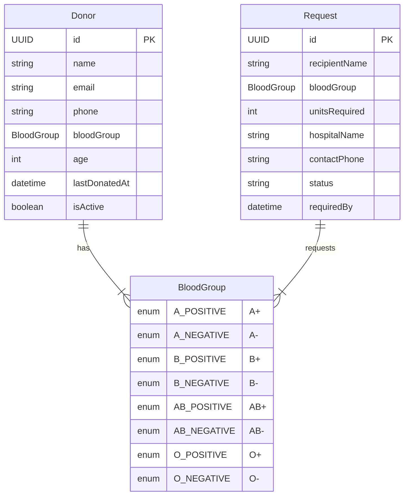

# Shared Schema & Validation Package

This package (`@raktsetu/shared`) contains the shared data structures, constants, and runtime validation schemas used across both the backend (API) and frontend applications in the RaktSetu monorepo.

By placing this definition in a shared package, we ensure:

- Single source of truth for critical medical rules (like blood compatibility).
- Shared TypeScript types between frontend and backend.
- Uniform runtime validation using [Zod](https://zod.dev) for requests/responses.

---

## Entities & Relationships

### Blood Compatibility Rules

The `compatibilityMatrix` defines the red blood cell compatibility for blood donation:

| Donor Group | Can Donate To (Recipient Groups)   |
| ----------- | ---------------------------------- |
| **O-**      | All blood groups (Universal Donor) |
| **O+**      | O+, A+, B+, AB+                    |
| **A-**      | A-, A+, AB-, AB+                   |
| **A+**      | A+, AB+                            |
| **B-**      | B-, B+, AB-, AB+                   |
| **B+**      | B+, AB+                            |
| **AB-**     | AB-, AB+                           |
| **AB+**     | AB+ only (Universal Recipient)     |
